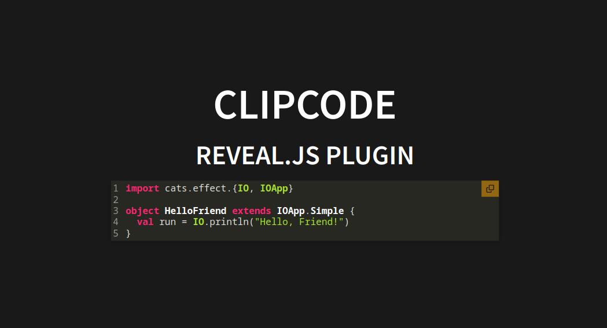

# ClipCode

[](https://www.npmjs.com/package/@edc4it/reveal.js-railroad)

---

## Reveal.js Code Snippet Copier

Enhance your Reveal.js presentations with an intuitive 'copy' button on all code blocks. Our plugin simplifies the process of allowing viewers to copy code snippets directly from your slides.

This project is inspired by the exceptional contributions of [Martinomagnifico](https://github.com/Martinomagnifico) and his [CopyCode plugin](https://github.com/Martinomagnifico/reveal.js-copycode). Martinomagnifico's version offers a broader range of features and has undergone extensive testing. Should you require a more comprehensive solution, we highly recommend exploring the [CopyCode plugin](https://github.com/Martinomagnifico/reveal.js-copycode).

### Preview



### Quick Setup

Configuring your Reveal.js presentations to include a 'copy' button for code blocks is straightforward. Follow these steps to get started:

---

### Installation

This plugin is published to, and can be installed from, npm.

```console
npm install add @edc4it/reveal.js-clipcode
```

Or using yarn

```console
yarn add @edc4it/reveal.js-clipcode
```

### Initialise (as npm library)

```js
import Reveal from 'reveal.js';
import ClipCode from '@edc4it/reveal.js-clipcode';

Reveal.initialize({
  clipcode: {
    style: {
      copybg: 'orange', // default
    },
  },
  plugins: [ClipCode],
});
```

### Use

```html
<pre>
  <code>
    Here is the code
  </code>
</pre>
```

## Global options

There are a few options that you can change from the Reveal.js options. The values below are default and do not need to be set if they are not changed. Some of the options were previously not nested; those overrides will continue to work.

```javascript
Reveal.initialize({
  // ...
  clipcode: {
    timeout: 1000,
    style: {
      copybg: 'orange',
      copiedbg: 'green',
      copycolor: 'black',
      copiedcolor: 'white',
      copyborder: '',
      copiedborder: '',
      scale: 1,
      offset: 0,
      radius: 0,
    },
  },
  plugins: [ClipCode],
});
```

- **`timeout`**: The time in milliseconds for the "Copied!"-state to revert back to "Copy".
- **`style`**: This is an object that contains options for text in the buttons
  - **`copybg`**: The background color.
  - **`copiedbg`**: The background color in the Copied state.
  - **`copycolor`**: The text color.
  - **`copiedcolor`**: The text color in the Copied state.
  - **`copyborder`**: A CSS 'border' rule. Can be, for example "1px solid gray".
  - **`copiedborder`**: A CSS 'border' rule. Can be, for example "1px solid green".
  - **`scale`**: The scale of the buttons.
  - **`offset`**: The offset (in em) from the top and the right.
  - **`radius`**: The border-radius (in em) of the buttons.
